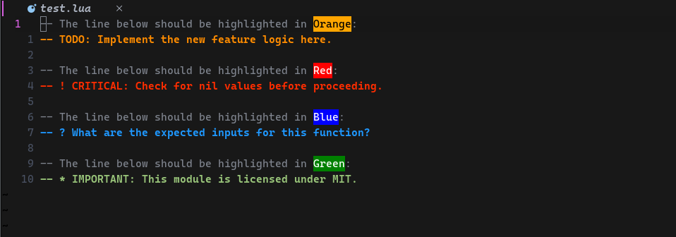

# Better Comments - NVIM

Better comments helps you to organize your comments with highlights and virtual text, offering behavior similar to the VS Code Better Comments extension.

# DEMO



## Installation

### Requirement

in order to use this plugin you need to set up treesiter

[nvim-treesitter/nvim-treesitter](https://github.com/nvim-treesitter/nvim-treesitter)

### Setup (using lazy.nvim)

```lua
{
    "Djancyp/better-comments.nvim",
    event = { "BufReadPre", "BufNewFile" }, -- Load before a file is read
    opts = {} -- default config
}
```

## Configs

### Default Config

```lua
tags = {
    {
        name = "!",
        fg = "#ff2d00",
        bg = "",
        bold = true,
    },
    {
        name = "?",
        fg = "#1f98ff",
        bg = "",
        bold = true,
    },
    {
        name = "todo",
        fg = "#ff8c00",
        bg = "",
        bold = true,
    },
    {
        name = "TODO",
        fg = "#ff8c00",
        bg = "",
        bold = true,
    },
    {
        name = "*",
        fg = "#98C379",
        bg = "",
        bold = true,
    },
},
```

### Overwrite defaults or add new Config

```lua
require('better-comments').setup({
    tags = {
        -- Overwrites the default 'TODO' to be bold with a blue background
        {
            name = "TODO",
            fg = "white",
            bg = "#0a7aca",
            bold = true,
        },
        -- Adds a new tag 'NEW'
        {
            name = "NEW",
            fg = "white",
            bg = "red",
            bold = false,
        },
    }
})
```

## Contributing

Pull requests are welcome. For major changes, please open an issue first to discuss what you would like to change.

Please make sure to update tests as appropriate.

## License

[MIT](https://choosealicense.com/licenses/mit/)
